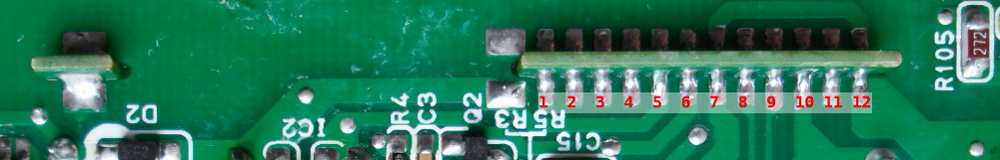
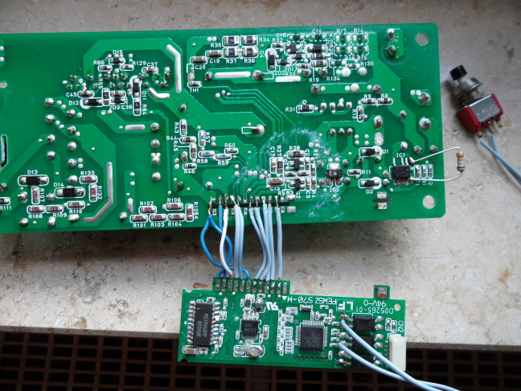
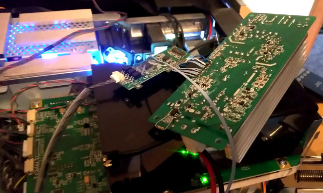
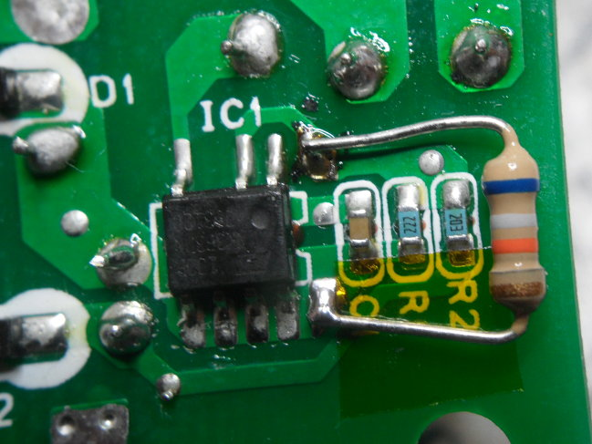
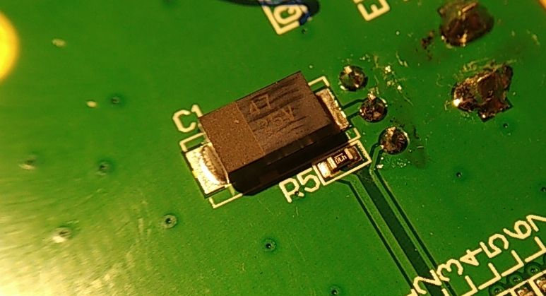
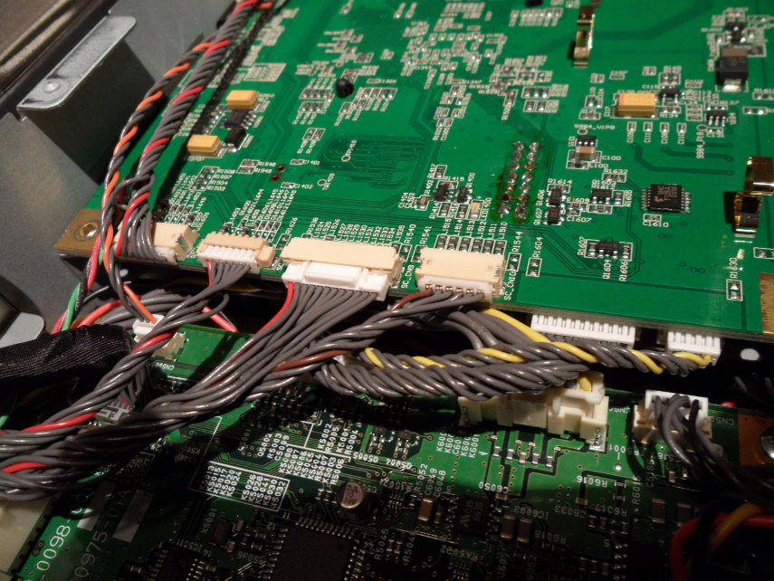
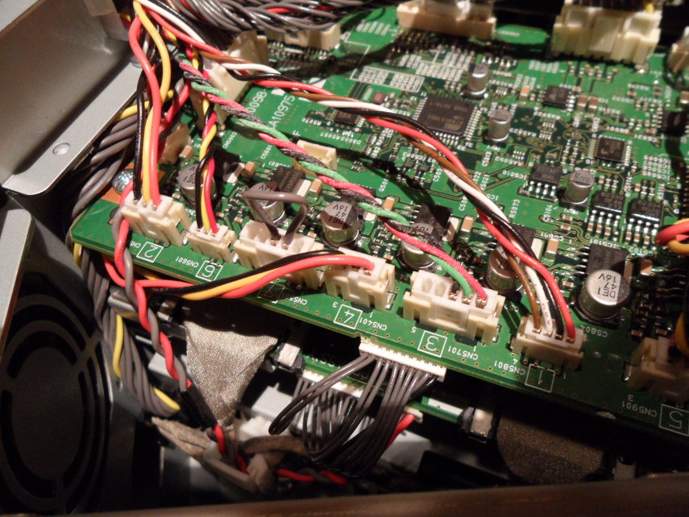
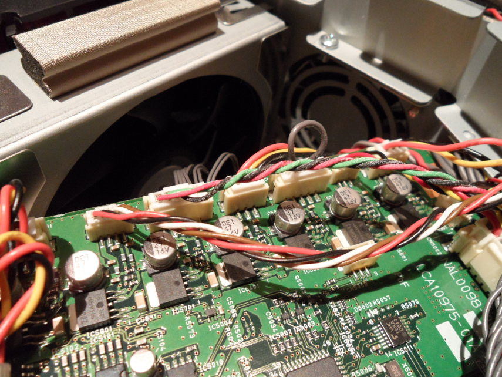
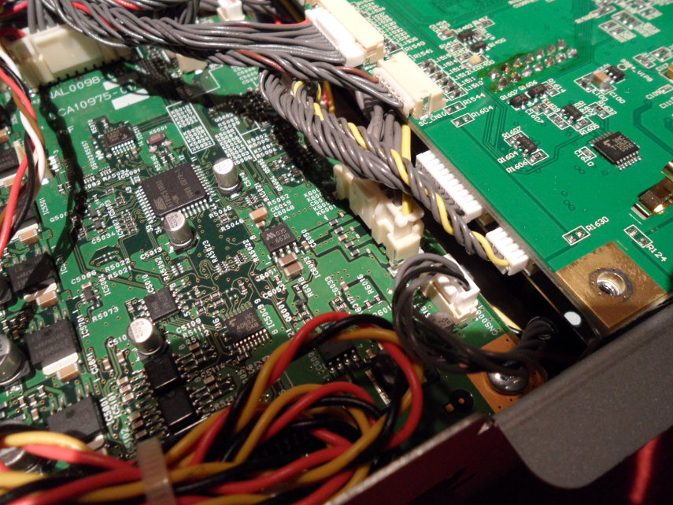

# About

This document provides an analysis of a broken JVC D-ILA projector (DLA-X3-BE) which I got for repair.

Failure description:

* lens cover opens and stays open
* lamp does not start
* fans do not start
* after some time the lamp LED indicator blinks (single blink pattern)

The information given here is based on this single broken device and information gathered from various forum threads. Different failure modes are reported in the forums, but these can be distinguished from the presented issue. The affected lamp ballast board is also used in various other projectors.

# Warning
Repair stuff at our own risk. The lamp ballast board is powered by dangerous voltage and its output is even worse. My presented solution may have negative impact on other components since an internal voltage is slightly increased. I have no long-term results of the fix yet.

Disassembling and reassembling the projector sucks, cursing might ensue.

# Summary

On the lamp ballast board IC1 (LNK364 or LNK363) generates an internal low voltage from the high input voltage. Feedback resistors are 2.2k and 20k, so effectively dividing the output voltage by 10. According to the datasheet the feedback pin threshold voltage is nominal 1.63V (specified limits 1.53V to 1.73V). This leads to an output voltage in the range of 15.3 to 17.3V (excluding resistor tolerance). I measured about 16.5V.

This voltage is used as supply voltage for a switching regulator IC M51995AFP on the vertical daughter board. The datasheet for this IC specifies the start-up voltage as nominal 16.2V (limits 15.2V to 17.2V).

Comparing the specified voltage ranges shows that this may sometimes work and sometimes doesn't. Due to component aging this may work for some time and then give intermittent failures to start or may stop working completely. After replacement of the LNK or the M51995 it may work again because the new part has a different threshold voltage, but it may fail again after some time.

My solution is an additional 68k resistor in parallel to the 2.2k feedback resistor of the LNK chip. This raised the output voltage slightly above 17V and the M51995AFP works again.

When you disassemble your projector, don't forget to check (and reverse if necessary) the tantalum capacitor on the small IR receiver board next to the lens, which is apparently assembled with wrong polarization on these devices and may cause issues.

# Some forum discussions
* [Long thread on AVSFORUM](https://www.avsforum.com/threads/replacing-jvc-ballast.2047338/)
* [Short thread on AVSFORUM](https://www.avsforum.com/threads/jvc-dla-x-rs-series-ballast-repair.3111164/)
* [Long thread at Beisammen.de (German)](https://www.beisammen.de/index.php?thread/121547-lamp-ballast-board-defekte-der-jvc-dla-x3-bis-x90-reihe-austausch-des-ersatzteil/&pageNo=2)

# Lamp ballast board analysis

## Check issues reported on forums

Searching the web for the error symptoms of the projector I quickly found the "lamp ballast" threads. This board is apparently a 3rd party component made by Rubycon. In some cases the LNK chip and supporting components (e.g. the through-hole resistor) are blown. Other people report broken optocouplers. If everything looks OK, replacing the M51995 sometimes seems to fix the issue.

I took the lamp ballast board out of the projector and checked these things. My optocouplers were OK. To check the LNK chip I attached a laboratory power supply to the power input connector and at 30V the LNK was already running and generating an output voltage. The datasheet says that the minimum supply voltage is 50V, so you may need a higher voltage and the output voltage may not be perfectly stabilized at such low input voltage. 

IC2 seems to be a 5V linear regulator, which also worked.

According to the forum threads the M51995 was now the possible culprit. Not bothering to investigate further at that time I just ordered some from China (apparently the IC is out of production, so no dealers here had this in stock). After weeks of waiting the new IC was put in but the projector still did not work.

Bad solder joints were also reported somewhere, so I re-soldered everything that looked suspicious, but still no success.

## Testing the board in the projector without assembling everything each time

To access the ballast board a stack of other boards with a huge amount of connectors has to be removed. Only then the screws holding a metal frame can be accessed, where the ballast board is mounted on the underside in a plastic air flow guiding frame. To test the projector, all boards with all connectors must be mounted again. In one of the forum threads someone suggests that the metal frame and all the other boards can be assembled and finally the ballast board in its plastic frame can be shoved in place. You cannot access the screws to fix the plastic frame anymore, but there is hardly any space in any direction for it to move, so it can just sit there without being fixed. The lamp wires are only just long enough to be able to plug the connecor in and out.

If you removed the plastic back cover of the projector, put at least the lamp access cover back on (with screw), otherwise the projector will not start and "Lamp cover is removed" error occurs (lamp LED blinks 3 times each).

For quick tests I just put the ballast board on top of the projector, separated by the plastic frame:

In this configuration there is no air flow, so the ballast board might overheat if it actually starts working. So use this only for short tests and maybe put a fan near. Don't touch anything because of the high voltages involved. It would also advise against performing any measurements in this configuration. Lots of things can be checked in a safer environment outside the projector (see next paragraph).

## Analyzing the board outside of the projector

How does the main controller tell the ballast board to switch on? There are three optocouplers, two in direction towards the ballast board and one in opposite direction. I expected something like SPI bus but that was wrong. The control signal to start the lamp is apparently just a constant signal on the center optocoupler. Upon start-up, the signal is activated three times for several seconds and then the main controller seems to give up and shows the blinking LED.

Since an optocoupler basically shorts two pins on the receive side when a signal comes in, a switch was soldered on for me to simulate the start signal. The lab power supply was attached again and an oscilloscope used to probe various points on the board to check if there is any reaction to the start signal. There was none.

Warning again: even if the board is powered from low voltage, it generates a much higher voltage if it eventually works. To try to stay away from the parts of the board near the lamp output connector.

To check if there is something wrong with the vertical daugher board or the large board I removed the daugherboard and reverse engineered the pinout. The following list defines pin 1 being towards the optocoupler side of the daughter board. Signal direction is given w.r.t. the daughter board.

Pin | Direction | Suggested function
----|----|----
1  | n.c.   | No connection
2  | Input  | Input voltage feedback, divider 990k - 10k
3  | Output | Activates the SLA2601 H-bridge (FO pin)
4  | Output | PWM signal for SLA2601 H-bridge (IN pin)
5  | Input  | Supply voltage generated by LNK
6  | Input  | Supply voltage +5V
7  | Input  | GND
8  | Input  | Intermediate voltage feedback, divider 660k - 16k
9  | Input  | Intermediate voltage feedback, divider 300k - 130k
10 | Input  | Current measurement from 50mOhm resistor
11 | Output | Vout from M51995 chip
12 | Input  | GND

I connected the GND pins, pin 5 and 6 of the daugher board to a lab power supply. The voltage at pin 5 was set to 16.5V. Now something happened for a few seconds while the start signal was active:

* 84 kHz square wave at pin 4 of the board
* ON/OFF (pin 7) of M51995 goes low to switch it on

Why did this not happen when the board was assembled? I connected the daughter board to the large board by wires, which I could then remove and connect individually. Power was now provided again by applying voltage to the power input connector of the ballast board.

With all wires assembled between the boards, there was again no reaction. It turned out that disconnecting pin 2 led to the signals showing up again. Not sure what that logic is about.

There was still no signal at pin 11, so something prevented the M51995 from working. I probed the CF pin (pin 12) of the IC and there was nothing going on, so the oscillator was not even active while the IC was switched on by the ON/OFF pin.

Digging through the datasheet the start-up voltage specification from 15.2V to 17.2V came up. Once the chip is running it should work down to 10V, but the start-up voltage must be reached at least once. I disconnected pin 5 from the main ballast board and attached another lab supply. By repeated power cycles and activating the start button I found a threshold of approx. 16.8V where the M51995 started working. For unknown reason the IC only started on the second button push in this configuration. Remember that now the board generates a higher voltage, so watch out.

To increase the LNK output voltage slightly I soldered a 68k resistor parallel to the 2.2k resistor in the feedback divider. Then the output voltage was slightly above 17V. I did not want to raise the voltage too much because other components involved might not like this. Your projector might need a different resistor value. With all wires conected again the board now tried to do something when the button was pressed.

Picture of this setup, including the start button to simulate the optocoupler switching:

Next I put it into the projector and it starts up successfully.

Final modified voltage divider:

After re-assembly of the ballast board and the whole projector it still works fine.

# Capacitor issue on the IR receiver board
The small board on the front next to the lens usually has a capacitor soldered on with wrong polarity.

Picture showing the wrong state (marked side should not be connected to ground plane):

There are reports of picture dropout caused by this. The capacitor might also heat up, blow up and/or kill the power supply in this wrong configuration. I just reversed it because it looked OK. If it looks suspicious or you already had picture dropout, you may want to replace it.

# More pictures
Some pictures I took to remember how to put the projector together again:

